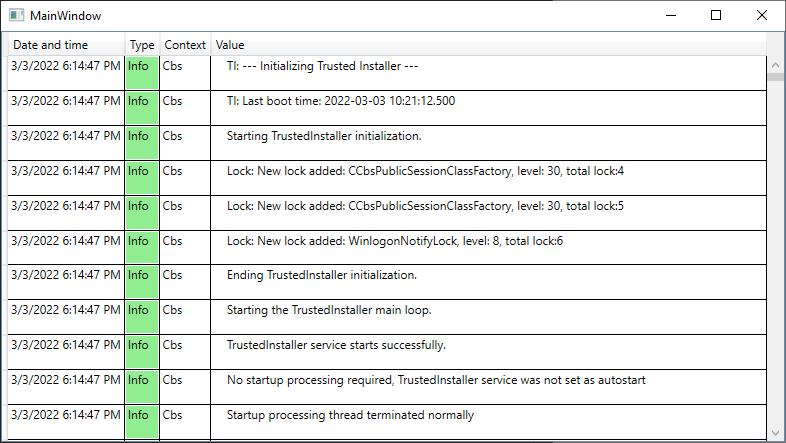

# CBSInterpreter

A simple tool that helps to read out CBS log file.

Simplified reading:

- Error, warning and info types color-marked
- Context differences
- DateTime values

## Requirements

- [.NET 6.0.2](https://dotnet.microsoft.com/en-us/download/dotnet/6.0/runtime) **Desktop Runtime**
- Actually developed on Windows 10 (21H2) and Microsoft Visual Studio 2022 Preview

## Screenshot

